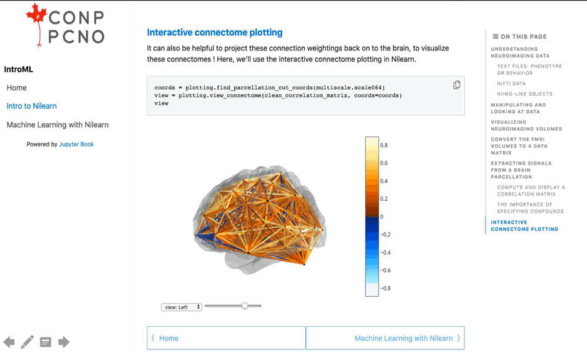

@snap[west span-50]
### @color[red](We were pondering about a powerful publishing item.)
@snapend

@snap[east span-50 fragment]
### @color[gray](When we listed our needs, the solution revealed itself!)  
@snapend
---
@transition[zoom]

 

@css[tip](Take on a brief tour of these three options brought by the Jupyter Book.)

@fa[arrow-down fa-3x icon-color]

+++?image=img/bg/green.jpg&position=right&size=65% 100% 
@title[Enliven your papers]

@snap[west span-30]
### @color[gray](Enliven your papers)  

@snapend

@snap[north-east text-left text-06 span-65]
@snap[text-left text-bold]
@color[white](We know that pages long static PDFs are only a part of your research story.)
@snapend
 
@snap[text-left text-bold]
@color[black](Jupyter Books offer you an easy way to supercharge your published work and advance that story!)
@snapend
 

@ol[split-screen-list text-09]
- Breathe interactivity into the display items of your old papers. Readers can replicate your key figures and explore your findings like never before. 
- Transform a pseudo-algorithm into an online executable codeblock of your favorite language.   
- Create a digital narrative of your summary analysis, boost up the reproducibility of your study.
@olend

@snapend

+++?image=img/bg/blue.jpg&position=right&size=65% 100% 
@title[Create interactive tutorials]

@snap[west span-30]
### @color[gray](Create interactive tutorials)  

@snapend

@snap[north-east text-left text-06 span-65]

@snap[text-left text-bold]
@color[white](Imagine people who'd like to learn how to use a programming tool or a computational science subject.)  
@snapend
 
@snap[text-left text-italic]
@color[white](Bouncing between documents and a software won't make it any easier for them, let alone getting all the neccesary tools working properly.)
@snapend
 
@snap[text-left text-bold]
@color[black](Creating interactive tutorials with Jupyter Books, you can take this burden away!)
@snapend
 

@ol[split-screen-list text-09]
- Help learners focus their attention on a single page, where implementation meets information. 
- Make all the computational material readily available for executing code online, with one click.  
- Use interactive widgets to create a seamless learning experience. Few gestures can surrogate multiple lines of code.
@olend

@snapend

+++?image=img/bg/orange.jpg&position=right&size=65% 100% 
@title[Share a brief analysis]

@snap[west span-30]
### @color[gray](Share a brief analysis)  

@snapend

@snap[north-east text-left text-06 span-65]

@snap[text-left text-bold]
@color[white](You are onto something interesting, but not ready for writing a paper yet?)
@snapend
 
@snap[text-left text-italic]
@color[white](Instead, you may want to share your preliminary results with your community and start a discussion. What if there was a publishing item - of your own - that eases the communication?)
@snapend

Good news, Jupyter Books have you covered!   

@ol[split-screen-list text-09]
- Make the most out of the interactive medium to get your points across clearly.  
- Organize text and one or more computational environment in one place.  
- Feed your data into the publication from your favorite data repository. 
@olend

@snapend

---

@snap[west span-50]
## @color[gray](Let us show you an example!)
@snapend

@snap[east span-50]

@snapend

@snap[south]
@fa[arrow-down fa-3x icon-color]
@snapend

+++
@title[Anatomy of a Jupyter Book.]

#### @color[gray](Anatomy of a Jupyter Book)

+++
@title[iframe]

#### @color[gray](Give interactive figure a try!)
@css[tip2](Jupyter Book from the previous slide will be rendered. It may take few seconds. Use arrows on the lower right corner for navigation.)

<iframe src="https://brainhack101.github.io/introML-book/01/MAIN_tutorial_intro_to_nilearn.html#interactive-connectome-plotting" width="100%" height="600" frameborder="0" marginwidth="0" marginheight="0"></iframe>

---

--> Can I start writing my paper in Jupyter Book? 

In theory, you can. But in practice, Jupyter Book's ecosystem does not provide you with a word processor for collaborative text editing. So, it may not be the most convenient way to start writing a paper from scratch. It is a medium where you bring different pieces together to create an open, interactive and reproducible publication. 

--> My work does not include any code. What value can Jupyter Books add to my workflow? 

--> License? 

--> Citing? 
